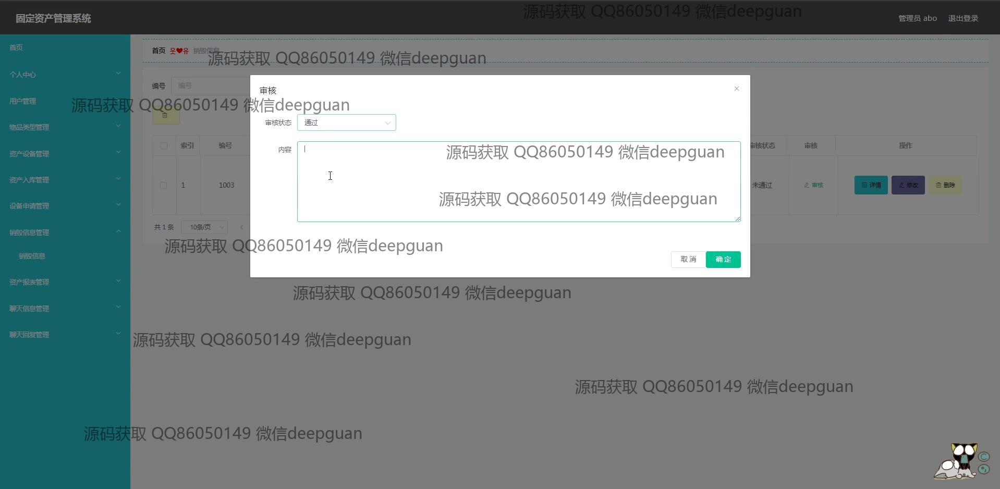

<h1 align="center">的固定资产管理系统vue</h1>

## 简介
固定资产管理系统：具备用户管理、物品类型管理、资产设备管理、入库管理、资产申请及审批功能，界面设计简洁直观，支持资产信息的增删改查和数据统计分析，提高企业资产管理效率。    --计算机毕业设计源码；毕设源码；java毕业设计源码

## 联系方式

<h3 align="center">获取完整代码与数据库文件 + 微信：deepguan QQ: 86050149 QQ群: 783742310</h3>

<h3 align="center">可帮忙远程部署 包运行成功！提供远程部署、修改代码、设计文档指导、代码讲解等服务！</h3>

## 功能介绍（完整见运行截图）
管理员：功能包括用户管理、资产管理、物品类型管理、资产入库管理、设备申请管理以及报表生成。可进行用户注册、登录、修改信息及权限分配等操作，支持资产的录入、编辑、删除及详细信息查看。管理系统内的设备申请和审批流程，生成和查看资产报表，并管理系统聊天和通知功能。

用户：功能涵盖个人信息管理、资产设备申请及查询。用户可以注册、登录并修改个人信息，有权限提交资产申请并查看审批状态。用户可查询设备的详细信息，查看和参与系统内的聊天功能，将资产信息进行分类管理以提高资产使用和维护效率。

## 运行截图

本代码来源于网络,仅供学习参考使用!

